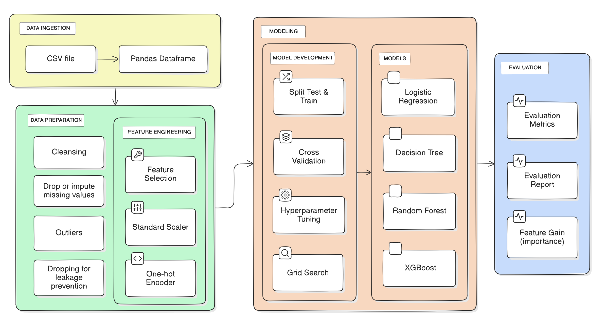

# Predicting booking cancellations using Tree-based models ([notebook link](https://github.com/ursumarius/booking-cancellations-ML-intro/blob/main/modeling/hotel-booking-eda-intro-to-ml.ipynb))
### Context: Introductory course on Machine Learining
### Authors: Pedro, Georgios and Marius

## Project objectives:
* Practice data cleansing and preparation
* Reason and select applicable algorithms for prediction
* Extract requirements from the business objectives (e.g. feature importance must be explainable)
* Hyper parameter tuning using Grid Search
* HP tuning using k-fold cross validation - ensuring the model generalizes well
* Select performance metrics taking into account the business objectives (balance FP and FN, therefore we choose F1-score)

## Pipeline

## Results

<table id="T_08f97">
  <thead>
    <tr>
      <th class="blank level0" >&nbsp;</th>
      <th id="T_08f97_level0_col0" class="col_heading level0 col0" >Accuracy</th>
      <th id="T_08f97_level0_col1" class="col_heading level0 col1" >Precision</th>
      <th id="T_08f97_level0_col2" class="col_heading level0 col2" >Recall </th>
      <th id="T_08f97_level0_col3" class="col_heading level0 col3" >F1-score </th>
      <th id="T_08f97_level0_col4" class="col_heading level0 col4" >AUC</th>
    </tr>
  </thead>
  <tbody>
    <tr>
      <th id="T_08f97_level0_row0" class="row_heading level0 row0" >XGBoost</th>
      <td id="T_08f97_row0_col0" class="data row0 col0" >84.74%</td>
      <td id="T_08f97_row0_col1" class="data row0 col1" >79.29%</td>
      <td id="T_08f97_row0_col2" class="data row0 col2" >80.01%</td>
      <td id="T_08f97_row0_col3" class="data row0 col3" >79.65%</td>
      <td id="T_08f97_row0_col4" class="data row0 col4" >92.12%</td>
    </tr>
    <tr>
      <th id="T_08f97_level0_row1" class="row_heading level0 row1" >Random Forest</th>
      <td id="T_08f97_row1_col0" class="data row1 col0" >84.79%</td>
      <td id="T_08f97_row1_col1" class="data row1 col1" >88.06%</td>
      <td id="T_08f97_row1_col2" class="data row1 col2" >68.54%</td>
      <td id="T_08f97_row1_col3" class="data row1 col3" >77.09%</td>
      <td id="T_08f97_row1_col4" class="data row1 col4" >92.03%</td>
    </tr>
    <tr>
      <th id="T_08f97_level0_row2" class="row_heading level0 row2" >Decision Tree</th>
      <td id="T_08f97_row2_col0" class="data row2 col0" >83.39%</td>
      <td id="T_08f97_row2_col1" class="data row2 col1" >82.41%</td>
      <td id="T_08f97_row2_col2" class="data row2 col2" >70.56%</td>
      <td id="T_08f97_row2_col3" class="data row2 col3" >76.03%</td>
      <td id="T_08f97_row2_col4" class="data row2 col4" >89.17%</td>
    </tr>
    <tr>
      <th id="T_08f97_level0_row3" class="row_heading level0 row3" >Logistic Regression</th>
      <td id="T_08f97_row3_col0" class="data row3 col0" >80.56%</td>
      <td id="T_08f97_row3_col1" class="data row3 col1" >83.15%</td>
      <td id="T_08f97_row3_col2" class="data row3 col2" >60.1%</td>
      <td id="T_08f97_row3_col3" class="data row3 col3" >69.77%</td>
      <td id="T_08f97_row3_col4" class="data row3 col4" >85.05%</td>
    </tr>
  </tbody>
</table>

Ensemble methods performed best. XGBoost had the strongest F1, Accuracy, AUC, and Recall scores. Recall: helpful for FN, for preventing low occupancy.
Random Forest: best for Precision - helpful for FP optimization, for preventing overbooking.
Test vs Train result comparison showed no overfitting concerns.

Note: other projects achieved scores of 80%+, however: it is unclear how balanced those datasets were, and whether sufficient precautions were taken to avoid overfitting. Moreover, results strongly vary between hotels.

### Feature importance:

Analysis:
* ``deposit_type_Non-Refundable`` has shown consistent predictive power, especially in the XGBoost and the DT models. When there is a deposit, people are less likely to cancel.
* ``lead_time`` predicted well except in XGBoost, this is the amount of time between when the booking was made, and the check-in date.
* while ``total_of_special_requests``, ``required_car_spaces`` and the ``number`_of_previous_cancellations`` followed. 
* Other research papers uncovered ``country``, as well as ``lead_time``. 

## Discussion

The performance metric was chosen to be the F1-score, as it accounts for False negatives (predicting a customer will come while they do not), which directly impact the occupancy rate. It also accounts for False positives (predicting that a customer will cancel while they come), which, assuming it happens enough, combined with the hotel's policy, might lead to overbooking. 

Tree-based models have shown significant improvement over logistic regression. To further enhance these models, it is crucial for the hospitality industry to invest in the collection of more comprehensive and accurate data, including leading indicators like transportation ticket cancellations, and personal characteristics of the customers.

Our analysis revealed that the most influential predictors are those related to deposits. These factors directly affect the business through cancellation fees and overbooking, making them crucial considerations for hotel management

The application of these findings can result in a calculated approach to the risks of overbooking: damage to reputation, compliance to rules and regulations, and suffering costs and penalties in finding resolutions for customers. Another benefit is a tailored approach to those that cancel a lot: imposing fines on those that are deal-seekers and cancel because they do this often, and not imposing the same strict penalties on those that cancel for good reason: change in plans.

Adjusting incentives would introduce model drift, this is further discussed in the Limitations section.

## Detailed project description:

### Research questions
1. Which **performance metric** is the most appropriate indicator for optimizing hotel profitability ?

2. Which **models** perform best at predicting cancellations and non-cancellations ?

3. What **features** best predict booking cancellations ?

### Background research

Cancellations range between 20-60%. Reasons are many: change in plans, illness, weather, etc. Deal seekers are responsible for (perhaps) the majority of cancellations. They book many, canceling all but one.

In response, hotels employ two strategies: Stringent cancellation policies (which vary depending on terms and timing); and Overbooking (selling more than you can deliver) - relies on human experience and statistics - not predictive models.

In short:
* Well researched problem, technically
* Trees perform very well generally
* Amount of years and features that the data covers matters
* Best models are those tailored for one hotel
* Few if any studies exist that look into the business inventory allocation formula

### Data Understanding

TODO Visual.

* Data covers much more city hotels than resort hotels.
* Data covering: July 2015 - October 2017 ⚠⚠⚠
* Most guests are new - usually don't have previous cancellations.
* Most reservations are made near the date of the check in (small lead_time)

### Data Preparation

Cleansing and checking for accuracy:
  * In 332 rows the number of ``adults`` had a value of 0. Who booked it ?
``stays_in_weekend_nights`` , ``stays_in_week_nights`` are both 0. Impossible, one of two must be true.

Handling missing values:
  * For the variable ``agent``,we substituted the NaN instances by the first mode.
  * Too much NaN - > column dropped

Check outliers: 
  * traveling with 10 kids
  * no adults in the booking

Preventing data leakage:
  * The columns ( ``reservation_status`` and  ``reservation_status_date``) were dropped  as the hold cause-effect information about is_cancelled (our target variable). 

### Feature engineering

**Feature selection**: Trees have the function built-in
Some selection could help with incorporating human expertise + preventing overfitting. 

**Scaling**: only for Logistic Regression 

**One-hot encoding**: for categorical variables

### Choosing the algorithms

TODO

### Choosing the performance metric

TODO

### Limitations
**What cost did the business incur in the end ? What are their operating costs ?**

To optimize profitability, data about the price of each
night, combined with the number of nights of that booking, is
essential. This would allow us to define a new metric to
evaluate performance. We are also missing the essential
information on whether the room was re-booked or whether
the hotel suffered a loss in the end. This would help us
estimate the likelihood of late reservations. We have therefore
presented our models and formulas to be re-created by
someone with more business knowledge.

**Model drift once you incentivize new behavior.**
  * Re-training is essential. 
  * Use pilots for a restricted audience (A/B)

If these new
strategies are employed, the resulting behavior of the customer - in the face of new incentives - may not align with our model's
predictions. This is what we refer to as 'underfitting the data '.
For instance, a model trained on a period in which customers
were not incentivized to cancel, would not be a good predictor
when applied to years in which customers were incentivized
to cancel (by making it free to do so). Model re-training and
carefully crafted A/B tests are essential.

**Yearly patterns are important, and missing in our dataset. Our dataset is pre-covid, and not recent enough.**

The data spans less than three complete
years. "By not capturing a minimum of 3 to 4 years' worth of
data, it is plausible that the models did not fully apprehend
cancellation patterns or changes in distribution related to
seasonality." Overfitting or underfitting? “The real test would
be when this model is applied to unseen data from another
period” (Antonio et al., 2019)

**Models tailored to one hotel only**

Although the literature mentions that a hotel-specific
model is critical, we have decided to combine the data for the
two hotels. These hotels may be separated by the customer
segment and purpose of their stay. This influences the reasons
and frequency of cancellations. We opted to combine the data
to have a larger data pool. In addition, we relied on the models
to differentiate between the two classes automatically

**Customer segmentation and understanding the dynamics of the booking**: business or consumer. What they value and how they react to incentives...

Each hotel type: resort or business-focused implies details
about the "agent" who made the booking. This could be a
travel agent, an online booking platform, or a direct booking
by the customer. Understanding the role of these agents in the
booking process is crucial, as it can influence the hotel's
revenue and cancellation rates. We also do not profile the
customer: Business or leisure? The literature describes
different reasons for canceling between these two segments
and their responses to fees, costs and incentives.